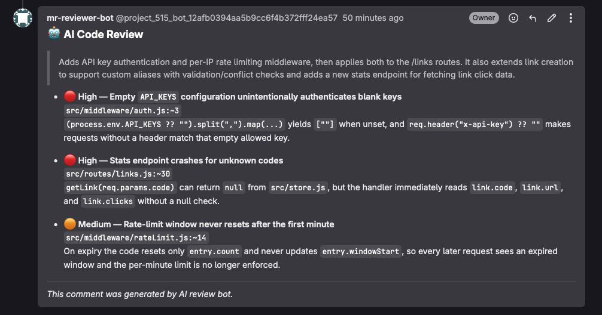
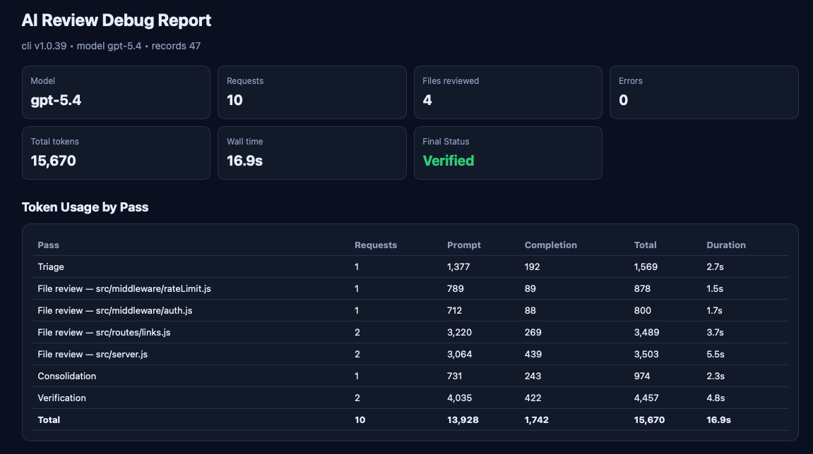
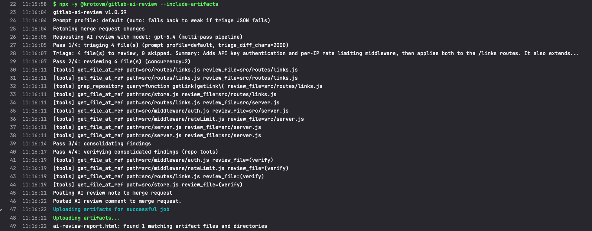

<!-- @format -->

# AI Code Reviewer

[](https://www.npmjs.com/package/@krotovm/gitlab-ai-review)
[](https://www.npmjs.com/package/@krotovm/gitlab-ai-review)
[](https://github.com/KrotovM/gitlab-ai-mr-reviewer/blob/main/LICENSE)
[](https://gitlab.com/explore/catalog/KrotovM/gitlab-ai-review)

Gitlab AI Code Review is a CLI tool that leverages OpenAI models to automatically review code changes and post a Markdown review to GitLab merge requests from CI.



## Features

- Automatically reviews code changes in GitLab repositories
- Provides feedback on bugs and optimization opportunities
- Generates Markdown-formatted responses for easy readability in GitLab as merge request comment

## Usage

### GitLab CI/CD

Run the tool in Merge Request pipelines to post a new AI review comment to the MR.

Minimal MR review job:

```yaml
stages: [review]

ai_review:
  stage: review
  image: node:24
  rules:
    - if: '$CI_PIPELINE_SOURCE == "merge_request_event"'
  script:
    - npx -y @krotovm/gitlab-ai-review
```

Or include it as a [CI/CD component from the GitLab Catalog](https://gitlab.com/explore/catalog/KrotovM/gitlab-ai-review) (gitlab.com):

```yaml
include:
  - component: gitlab.com/KrotovM/gitlab-ai-review/review@1.0.2
    inputs:
      args: "--include-artifacts"
```

Save debug HTML as a CI artifact:

```yaml
stages: [review]

ai_review:
  stage: review
  image: node:24
  rules:
    - if: '$CI_PIPELINE_SOURCE == "merge_request_event"'
  script:
    - npx -y @krotovm/gitlab-ai-review --include-artifacts
  artifacts:
    expire_in: 7 days
    paths:
      - ai-review-report.html
```

The HTML artifact breaks the run down per pass — tokens, durations, triage decisions, per-file findings, and errors:



## Env variables

Set these in your project/group CI settings:

- `OPENAI_API_KEY` (required)
- `OPENAI_BASE_URL` (optional, for OpenAI-compatible providers/proxies)
- `AI_MODEL` (optional, default: `gpt-4o-mini`; example: `gpt-4o`)
- `AI_PROMPT_PROFILE` (optional, default: `default`; one of `default` \| `weak`). Use `weak` for small or heavily-quantized models (≤ ~7B, local Ollama, etc.). The `weak` profile uses shorter system prompts, positive rules instead of negations, and inline few-shot examples for triage / per-file review / consolidation / verification, which dramatically improves output-format adherence on weak models. When the variable is not set, the profile is auto-detected: if the triage pass returns unparseable JSON with `default` prompts, triage is retried once with `weak` and, on success, the whole run continues with it. Set the variable explicitly to pin a profile and disable auto-detection.
- `PROJECT_ACCESS_TOKEN` (optional for public projects, but required for most private projects; token with `api` scope)
- `GITLAB_TOKEN` (optional alias for `PROJECT_ACCESS_TOKEN`)
- `AI_REVIEW_CONCURRENCY` (optional) — same as `--max-review-concurrency`, handy as a CI/CD variable; the flag wins when both are set.
- `AI_REVIEW_ARTIFACT_HTML_FILE` (optional, default: `ai-review-report.html`; used with `--include-artifacts`)

`OPENAI_BASE_URL` is passed through to the `openai` SDK client, so you can use any OpenAI-compatible gateway/provider endpoint.

GitLab provides these automatically in Merge Request pipelines:

- `CI_API_V4_URL`
- `CI_PROJECT_ID`
- `CI_MERGE_REQUEST_IID`
- `CI_JOB_TOKEN` (used only when `PROJECT_ACCESS_TOKEN` is not provided)

## Flags

- `--ignore-ext=md,lock` - Exclude file extensions from review (comma-separated only).
- `--max-diffs=50` - Max number of diffs included in the prompt.
- `--max-diff-chars=16000` - Max chars per diff chunk (single-pass fallback only).
- `--max-total-prompt-chars=220000` - Final hard cap for prompt size (single-pass fallback only).
- `--triage-diff-chars=2000` - Max chars per file diff sent to the triage pass (Pass 1). Increase for large diffs where the first hunks are mostly git headers.
- `--max-findings=5` - Max findings in the final review (CI multi-pass only).
- `--max-review-concurrency=2` - Parallel per-file review API calls (CI multi-pass only). Set to 1 for single-GPU backends that queue-starve long requests.
- `--debug` - Print full error details (stack and API error fields).
- `--include-artifacts` - Generate a local HTML debug artifact with per-pass outputs/tokens.
- `--help` - Show help output.

## Benchmark

Head-to-head against [Alibaba OpenCodeReview](https://github.com/alibaba/open-code-review) v1.8.10 (via its official GitLab CI recipe) on a demo MR with 4 seeded bugs: an auth bypass (`API_KEYS` unset → empty key accepted), a rate limiter whose window never resets, an unbounded per-IP counters Map, and a null-deref crash in a stats endpoint. Same MR, same commit range, same backends.

| Tool | Model | Seeded bugs found | Noise (dups / off-target) | Tokens | LLM time |
| --- | --- | --- | --- | --- | --- |
| **gitlab-ai-review** | gpt-5.4 | 3 / 4 | 0 | 15.7k | ~17s |
| OpenCodeReview | gpt-5.4 | 3 / 4 | 2 | 41.5k | ~11s |
| **gitlab-ai-review** | self-hosted (single GPU) | **4 / 4** | **0** | 37.2k | 7m 24s |
| OpenCodeReview | self-hosted (single GPU) | 3 / 4 | 8 (incl. 5 duplicates) | 151.8k | 11m 45s |

Notes:

- On gpt-5.4 both tools found the same 3 bugs and both missed the memory leak. OpenCodeReview added two design opinions, one of which (severity "high") suggested removing the very auth feature the MR introduces.
- On the self-hosted model the multi-pass pipeline (triage → per-file review → consolidate → verify) paid off: all 4 seeded bugs, zero noise. OpenCodeReview posted 11 comments: 3 unique real findings, 5 duplicates, and 3 off-target — its only rate-limiter comment misdiagnosed the bug, and several comments were attributed to the wrong file or line.
- Weak-model reviews are output-bound on a single GPU: OpenCodeReview generated 40.2k output tokens vs our 18.5k, and consumed 6× our prompt tokens (111.6k vs 18.7k) — that difference is the wall-clock gap.
- Methodology caveats: single run per cell on one MR; LLM variance applies.

## Architecture

The reviewer uses a three-pass pipeline optimized for large merge requests:

1. **Triage** - A fast LLM pass classifies each changed file as `NEEDS_REVIEW` or `SKIP`, with a per-file `reason`, and generates a short MR summary. Each file diff is truncated to `--triage-diff-chars` (default 2000).
2. **Per-file review** - Only `NEEDS_REVIEW` files are reviewed (if triage marks every file `SKIP`, all files are reviewed anyway). Each reviewed file gets a dedicated LLM call running in parallel (with tools to fetch full files or grep the repository).
3. **Consolidate** - Per-file findings are merged, deduplicated, ranked by severity, and trimmed to top N (default 5).

If the triage pass fails (API error, unparseable response), the pipeline falls back to the original single-pass approach automatically.

The pipeline in a CI job log — triage, parallel tool-assisted file reviews, consolidation, verification:


